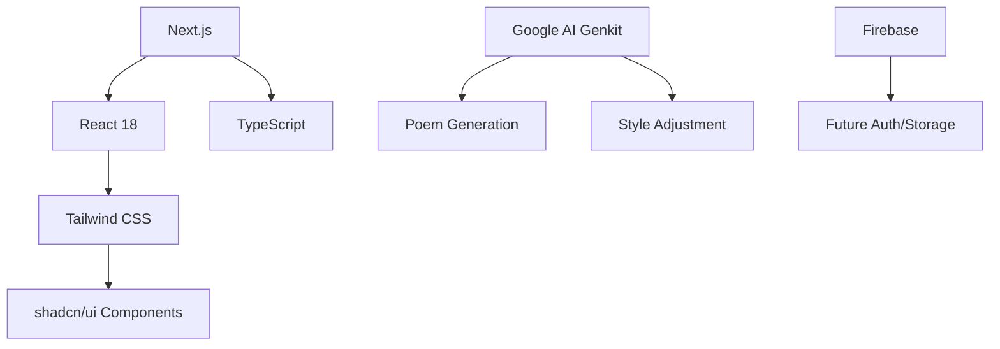
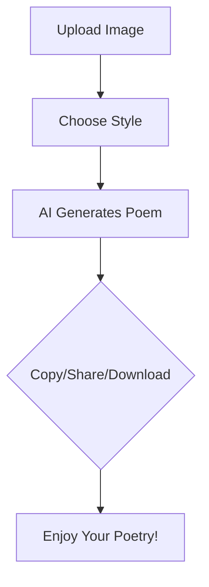
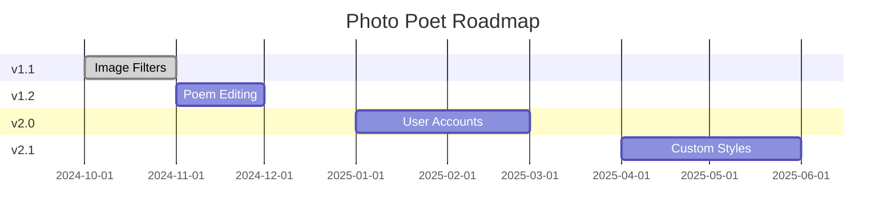

# Photo Poet 📸✨

<div align="center">
  
  
  
  
  
</div>

<p align="center">
  <strong>Transform your photos into beautiful, AI-generated poetry with just a few clicks.</strong><br>
  Upload an image, choose a style, and watch as AI weaves its essence into timeless verses.<br>
  <em>Because who needs words when pixels can poem? 🖼️➡️📜</em>
</p>

---

## 🌟 Features

<div align="center">

| Feature | Description |
|---------|-------------|
| 🖼️ **Image Upload** | Drag-and-drop or click to upload (JPEG, PNG, GIF, WebP) up to 10MB |
| 🤖 **AI-Powered Poetry** | Generates unique poems inspired by your images using Google's Genkit AI |
| 🎨 **Multiple Styles** | Choose from Free Verse, Haiku, Sonnet, Limerick, or Elegy |
| 🌙 **Dark Mode** | Toggle between light and dark themes |
| 📱 **Responsive Design** | Optimized for all devices |
| 📋 **Easy Sharing** | Copy, share, or download your poems |
| 📖 **Tutorial** | Step-by-step onboarding |
| 🕒 **Poem History** | Track recent creations |

</div>

> **Fun Fact**: This app once turned a picture of a rubber duck into a Shakespearean sonnet. Quack-tastic! 🦆📖


*Experience the magic: Upload an image and see it transformed into poetry!*

---

## 🛠️ Tech Stack

<div align="center">



</div>

- **Frontend**: Next.js 15.3.3 (React 18.3.1) with TypeScript
- **Styling**: Tailwind CSS for responsive, modern UI
- **AI Integration**: Google AI Genkit for poem generation and style adjustment
- **UI Components**: shadcn/ui for consistent, accessible components
- **Deployment**: Configured for static export (GitHub Pages ready)

---

## 📦 Installation

1. **Clone the repository**:
   ```bash
   git clone https://github.com/Sahilp2407/Photo-Poet.git
   cd Photo-Poet
   ```

2. **Install dependencies**:
   ```bash
   npm install
   ```

3. **Set up environment variables** (optional for local development):
   - Create a `.env` file in the root directory.
   - Add your Google AI API key (if using advanced features):
     ```
     GOOGLE_AI_API_KEY=your_api_key_here
     ```


---

## 🎯 Usage

<div align="center">



</div>

1. **Upload an Image**: Drag and drop a photo or click the upload button.
2. **Select a Style**: Choose your preferred poetry style from the dropdown.
3. **Generate Poetry**: The AI will create a unique poem based on your image.
4. **Customize**: Adjust the style or regenerate for variations.
5. **Share**: Copy, download, or share your poem with others.

### Example Poem Output

```
Where light and shadow softly correspond,
A silent chair, a window just beyond.
The world outside, a muted, hazy view,
Awaiting thoughts, both old and freshly new.

A stark design, in simple, graceful lines,
Where quiet contemplation intertwines.
This empty stage, for stories to unfold,
In whispers of the future, brave and bold.
```

> **Pro Tip**: Try uploading a selfie – you might discover you're secretly a Renaissance painting! 🎨😄

---

## 🗺️ Roadmap

Here's our exciting roadmap for future features:

<div align="center">

| Version | Feature | Status |
|---------|---------|--------|
| v1.1 | **Image Filters** | 🔄 In Progress |
| v1.2 | **Poem Editing** | ⏳ Planned |
| v2.0 | **User Accounts** | 📅 Q1 2025 |
| v2.1 | **Custom Styles** | 📅 Q2 2025 |
| v3.0 | **Mobile App** | 🚀 Future |

</div>



</div>

---

## 🌐 Deployment

This project is configured for static export, making it easy to deploy on GitHub Pages or other static hosting services.

### Deploy to GitHub Pages

1. **Build the project**:
   ```bash
   npm run build
   ```

2. **Push to GitHub**:
   - Ensure your repository is set up (e.g., `yourusername.github.io` for a personal site).
   - Commit and push your changes.

3. **Enable GitHub Pages**:
   - Go to your repository's Settings > Pages.
   - Select "Deploy from a branch" and choose `main` branch.
   - Your site will be live at `https://yourusername.github.io/Photo-Poet`.

### Other Platforms

- **Vercel**: Connect your GitHub repo for automatic deployments.
- **Netlify**: Drag and drop the `out` folder or connect via Git.

---

## 🤝 Contributing

We welcome contributions! Here's how you can help:

1. **Fork the repository**.
2. **Create a feature branch**: `git checkout -b feature/amazing-feature`.
3. **Make your changes**.
4. **Test thoroughly**.
5. **Commit your changes**: `git commit -m 'Add amazing feature'`.
6. **Push to the branch**: `git push origin feature/amazing-feature`.
7. **Open a Pull Request**.

### Development Guidelines

- Follow TypeScript best practices.
- Use conventional commit messages.
- Ensure responsive design for all new features.
- Add tests for new functionality.
- Keep it fun – poetry should inspire joy! 😊

> **Joke Break**: Why did the AI poet go to therapy? It had too many unresolved images! 🛋️😂

---

## 🐛 Issues and Support

If you encounter any bugs or have feature requests, please [open an issue](https://github.com/Sahilp2407/Photo-Poet/issues) on GitHub.

For support, join our community discussions or reach out via email.

---

## 📄 License

This project is licensed under the MIT License - see the [LICENSE](LICENSE) file for details.

---

## 🙏 Acknowledgments

- Built with [Next.js](https://nextjs.org/) and [Tailwind CSS](https://tailwindcss.com/).
- Powered by [Google AI Genkit](https://github.com/firebase/genkit).
- UI components from [shadcn/ui](https://ui.shadcn.com/).
- Inspiration from countless poets and pixel artists! 🎭

---

<div align="center">
  <strong>Made with ❤️ by Sahil Pandey</strong><br>
  <em>Transforming pixels into poetry, one image at a time.</em><br>
  <sub>Because life's too short for boring photos! 📸😜</sub>
</div>

